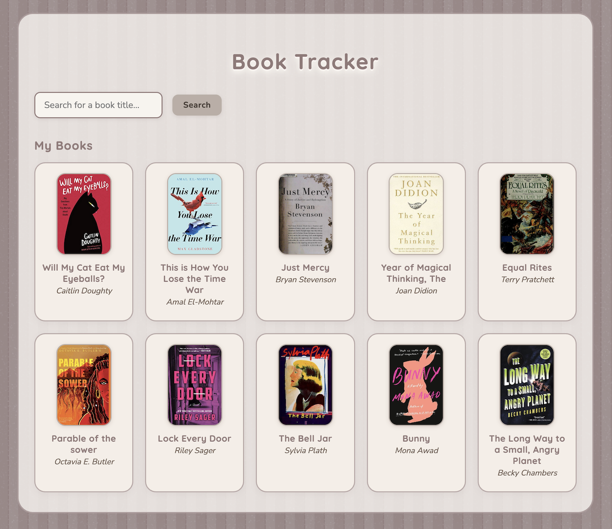

[Deploy to Netlify]: https://app.netlify.com/start/deploy?repository=https://github.com/netlify/examples/&create_from_path=examples/netlify-neon-books&utm_campaign=dx-examples

# Netlify DB Book Tracker

A simple book tracking app that allows users to search for books and save them to a database.

## Clone and deploy this example

Deploy your own version of this example site, by clicking the button below. This will automatically:

- Clone a copy of this example from the [examples repo](https://github.com/netlify/examples) to your own GitHub account
- Create a new project in your [Netlify account](https://app.netlify.com/?utm_medium=social&utm_source=github&utm_campaign=devex-ph&utm_content=devex-examples), linked to your new repo
- Create an automated deployment pipeline to watch for changes on your repo
- Build and deploy your new site

[][Deploy to Netlify]

## More examples

Explore other examples of using the Netlify platform and primitives (with or without a framework) in this [examples repo](https://github.com/netlify/examples).
